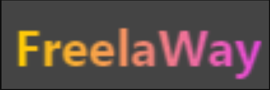
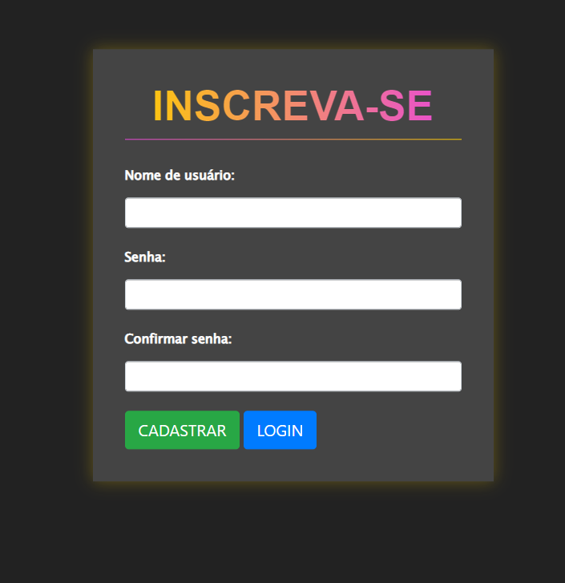
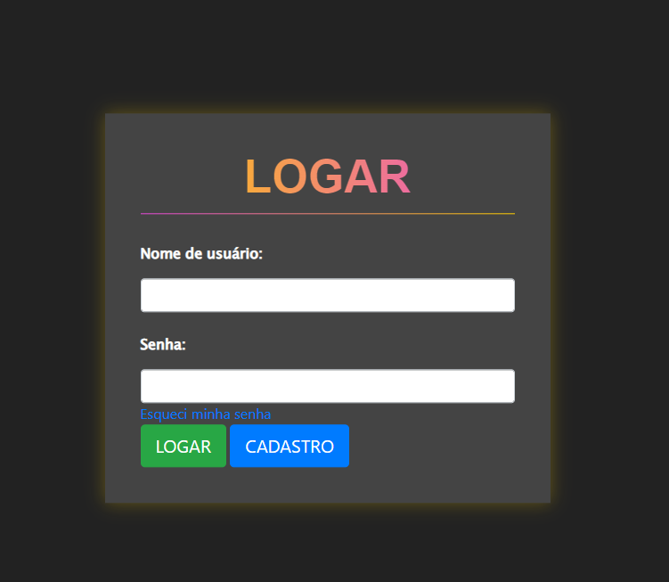
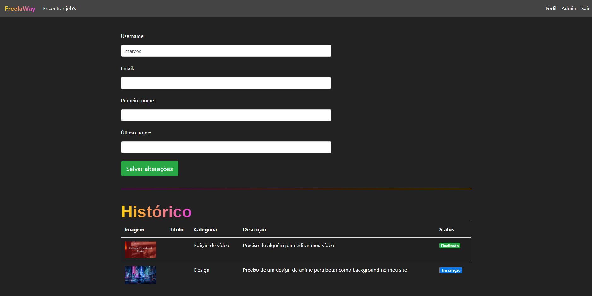

<div align="center" id="top"> 
  

<!-- &#xa0; -->

  <!-- <a href="https://freelaway.netlify.com">Demo</a> -->
</div>

<div align="center"> 
  <h1 align="center">Freelaway</h1>
  <!--  -->
</div>

<!-- Status -->

<!-- <h4 align="center">
	🚧  Freelaway 🚀 Em construção...  🚧
</h4>
<hr> -->

<p align="center">
  <a href="#dart-sobre">Sobre</a> &#xa0; | &#xa0; 
  <a href="#sparkles-funcionalidades">Funcionalidades</a> &#xa0; | &#xa0;
  <a href="#rocket-tecnologias">Tecnologias</a> &#xa0; | &#xa0;
  <a href="#white_check_mark-pré-requisitos">Pré requisitos</a> &#xa0; | &#xa0;
  <a href="#checkered_flag-começando">Começando</a> &#xa0; | &#xa0;
  <a href="https://github.com/Hyoukka" target="_blank">Autor</a>
</p>

<p align="center">
  
  
  
  
  
  
</p>

## 🎯 Sobre

O projeto inicial foi desenvolvido durante o evento [Pystack Week 3.0](https://pythonando.com.br).\
A proposta é criar um sistema de ofertas de trabalhos para contratar profissionais freelancer.

## ✨ Funcionalidades

✔️ Login/Logout;\
✔️ Cadastro de usuários;\
✔️ Recuperação de senha;

## 🚀 Tecnologias
- [Python](https://www.python.org/)
- [Django](https://nodejs.org/en/)
- HTML
-CSS
- [Bootstrap](https://getbootstrap.com/)

## ✅ Pré-requisitos

Antes de começar 🏁, você precisa ter o [Python](https://www.python.org/downloads/) instalado em sua maquina.

## 🏁 Como usar

1 - Primeiro clone o repositório e entre na pasta do projeto.

```bash
# Clone este repositório
$ git clone https://github.com/Hyoukka/Freelaway
# Entre na pasta
$ cd Freelaway
```

2 - Segundo inicie um ambiente virtual

```bash
# Criar
  # Linux
    $ python3 -m venv venv
  # Windows
    $ python -m venv venv
#Ativar
  # Linux
    $ source venv/bin/activate
  # Windows
    $ venv/Scripts/Activate
# Caso algum comando retorne um erro de permissão execute o código e tente novamente:
  $ Set-ExecutionPolicy -Scope CurrentUser -ExecutionPolicy RemoteSigned
```

3 - Instale as dependências

```bash
# Instale as dependências
# Linux
$ pip3 install -r requirements.txt
# Windows
$ pip install -r requirements.txt
```

4 - Faça as migrações.

```bash
# Linux
python3 manage.py migrate
# Windows
python manage.py migrate
```

5 - Crie um super usuário

```bash
$ python3 .\manage.py createsuperuser
$ python .\manage.py createsuperuser
```

6 - Inicie a aplicação

```bash
# Para iniciar o projeto
# Linux
$ python3 manage.py runserver
# Windows
$ python manage.py runserver
# O app vai inicializar em <http://127.0.0.1:8000/>
# Para iniciar o projeto em uma porta especifica
$ python manage.py runserver <porta>
# O app vai inicializar em <http://127.0.0.1:<porta>/>
```
<a href="#top">Voltar para o topo</a>
